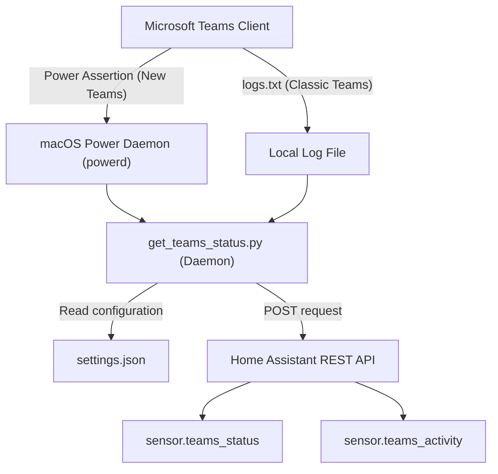

# TeamsAssist (macOS)

A native macOS background utility to monitor Microsoft Teams presence and call activity, and sync them with your Home Assistant smart home system. 

## How It Works

This daemon operates entirely locally without requiring Microsoft Graph API admin consent. It supports both **Classic Teams** and the **New Teams (Work or School)** client.



- **New Teams Call Detection**: Monitors macOS sleep assertions (`pmset`). When a meeting is active, Teams prevents the system from sleeping, creating a `Microsoft Teams Call in progress` assertion.
- **Classic Teams Presence**: Monitors the local `logs.txt` file for taskbar icon overlays to extract precise presence (Available, Busy, Away, etc.).
- **Background Execution**: Runs as a lightweight macOS Launch Agent daemon with zero external dependencies (pure Python 3).

---

## Installation & Setup

### 1. Home Assistant Preparation

Add the required sensors and helpers to your Home Assistant `configuration.yaml` file:

```yaml
# Input Text Helpers to receive states from the macOS script
input_text:
  teams_status:
    name: Microsoft Teams status
    icon: mdi:microsoft-teams
  teams_activity:
    name: Microsoft Teams activity
    icon: mdi:phone-off

# Modern Template Sensors (Home Assistant 2021.5+)
template:
  - sensor:
      - name: "Microsoft Teams status"
        unique_id: sensor.teams_status
        state: "{{ states('input_text.teams_status') }}"
        icon: "{{ state_attr('input_text.teams_status', 'icon') }}"
      - name: "Microsoft Teams activity"
        unique_id: sensor.teams_activity
        state: "{{ states('input_text.teams_activity') }}"
        icon: "{{ 'mdi:phone-in-talk-outline' if is_state('input_text.teams_activity', 'In a call') else 'mdi:phone-off' }}"
```

*Note: Restart Home Assistant to create these entities. For advanced automations (like automatic status light toggles and dashboard UI layouts), refer to the **[Home Assistant Setup Guide](HOMEASSISTANT_SETUP.md)**.*

#### Import Blueprint

Use the following blueprint to easily configure automations based on your Teams status (e.g. changing office lights):

[](https://my.home-assistant.io/redirect/blueprint_import/?blueprint_url=https%3A%2F%2Fgithub.com%2FTheRudin%2FTeamsAssist-macOS%2Fblob%2Fmain%2FAutomation%2Fteams-light.yaml)


### 2. Generate Long-Lived Access Token (CLI Helper)
You can easily generate your 10-year access token directly from the command line:
```bash
./Scripts/create_token.sh
```
This script will prompt you for your Home Assistant URL, username, and password, perform the login flow and WebSocket handshake, and output the token.

*(Alternatively, you can generate the token in the Home Assistant UI under User Profile > Long-Lived Access Tokens > Create Token).*

### 3. Configuration (`settings.json`)
Edit the **[settings.json](Scripts/settings.json)** file located in the `Scripts` directory:

| Setting Key | Type | Description | Default |
| :--- | :--- | :--- | :--- |
| `ha_url` | String | The URL of your Home Assistant instance. | `"<HA URL>"` |
| `ha_token` | String | Long-lived access token generated from your HA user profile. | `"<Insert token>"` |
| `teams_version` | String | `"Auto"`, `"New"`, or `"Old"`. `"Auto"` detects based on active processes. | `"Auto"` |
| `check_interval` | Integer| How often the script checks for status changes (in seconds). | `2` |
| `status_entity` | String | The sensor name for Teams availability status in HA. | `"sensor.teams_status"` |
| `activity_entity` | String| The sensor name for call activity in HA. | `"sensor.teams_activity"` |
| `monitoring_entity`| String| Binary sensor showing if the daemon is currently running. | `"binary_sensor.teams_monitoring"` |

### 4. Register background agent
Open your macOS Terminal, navigate to the folder, and run:
```bash
python3 Scripts/setup_launchagent.py
```
This registers, creates, and loads the Launch Agent. The daemon will now run continuously in the background and start automatically whenever you log in to your Mac.

---

## Daemon Management

### Viewing Logs
You can monitor log messages or troubleshoot issues using standard terminal commands:
- **Activity log**: `tail -f Scripts/teams_status.log`
- **Error log**: `tail -f Scripts/teams_status.err`

### Stopping the Agent
To disable and uninstall the background agent:
```bash
python3 Scripts/setup_launchagent.py --uninstall
```

### Manual Controls (Testing)
You can manually override states to test your Home Assistant automations without joining a call:
- Set status to Offline: `python3 Scripts/get_teams_status.py --status Offline`
- Set status to Available: `python3 Scripts/get_teams_status.py --status Available`
- Set activity to In a call: `python3 Scripts/get_teams_status.py --activity "In a call"`
